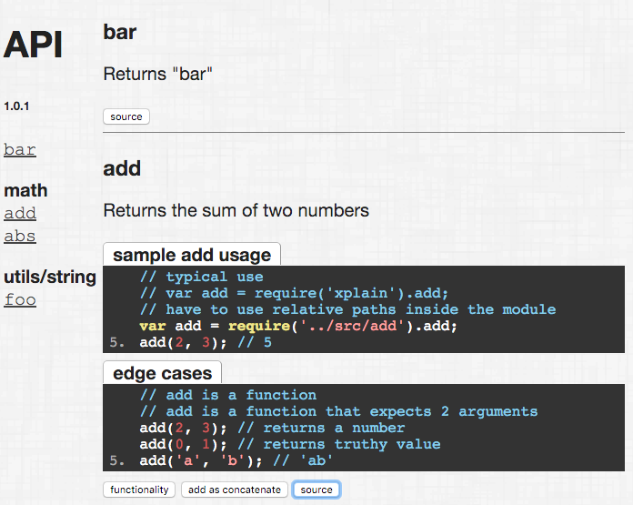

# xplain

> Generates API documentation / markdown inserts from unit tests

[![NPM][xplain-icon] ][xplain-url]

[![Build status][xplain-ci-image] ][xplain-ci-url]
[![dependencies][xplain-dependencies-image] ][xplain-dependencies-url]
[![devdependencies][xplain-devdependencies-image] ][xplain-devdependencies-url]
[![semantic-release][semantic-image] ][semantic-url]

[xplain-icon]: https://nodei.co/npm/xplain.png?downloads=true
[xplain-url]: https://npmjs.org/package/xplain
[xplain-ci-image]: https://travis-ci.org/bahmutov/xplain.png?branch=master
[xplain-ci-url]: https://travis-ci.org/bahmutov/xplain
[xplain-dependencies-image]: https://david-dm.org/bahmutov/xplain.png
[xplain-dependencies-url]: https://david-dm.org/bahmutov/xplain
[xplain-devdependencies-image]: https://david-dm.org/bahmutov/xplain/dev-status.png
[xplain-devdependencies-url]: https://david-dm.org/bahmutov/xplain#info=devDependencies
[semantic-image]: https://img.shields.io/badge/%20%20%F0%9F%93%A6%F0%9F%9A%80-semantic--release-e10079.svg
[semantic-url]: https://github.com/semantic-release/semantic-release




***This is still very early release, probably would not work right away for your needs.***

**xplain** takes unit tests and generates documentation examples. Check out the reverse:
[jsmd](https://github.com/vesln/jsmd) takes code blocks in Markdown and runs them as unit tests.

#### inputs

*src/add.js*

    /**
        Adds two numbers

        @method add
    */
    function add(a, b) { return a + b; }

*test/add.js*

    /** @sample add */
    QUnit.test('adds numbers', function () {
        QUnit.equal(add(2, 3), 5);
    });

#### usage

    xplain -i src/add.js -i test/add.js

produces HTML documentation:

**add**
    Adds two numbers

    add(2, 3); // 5

See the generated [example api](http://bahmutov.github.io/xplain/)

To see (the very few) command line options run `xplain` or `xplain -h` command.

### Updating Markdown doc

**xplain** can update code blocks inside a Markdown file (like this doc) with unit tests marked using *@sample*. If we have:

```
// add.js
/** @sample add */
gt.test('basic addition', function () {
  gt.equal(add(1, 2), 3, '1 + 2 = 3');
  gt.equal(add(100, -100), 0, '100 + -100 = 0');
});

// README.md
#### basic addition

  add(10, 20); // 30
```

then command `xplain -i add.js -o README.md` will update README.md and it will have:

```
// README.md
#### basic addition

  add(1, 2); // 3
  add(100, -100); // 0
```

This feature makes the package's top level README.md file a great place to provide lots of examples, without needing a separate API docs. It can be also used to
[unit test blog posts](http://glebbahmutov.com/blog/unit-testing-blog-posts/).

### Details

Stop writing unmaintainable source samples inside the
help comments using *@example* tag. Instead tag your unit tests with *@sample* or *@example* tag and they will be included in the generated API documentation.

The test code will be intelligently transformed into human
readable format. [QUnit](http://qunitjs.com/) and [gt](https://github.com/bahmutov/gt) test syntax is supported. If the code cannot be transformed, it will be displayed in its original form. *qunit* is assumed by default, specify an alternative using *-f* command line option, for example *-f gt*.

#### Multiple documentation levels

There are 4 levels of details captured in the API.

1. Method description from jsdoc comments
2. Sample source code transformed from the unit tests and displayed under the method
3. Unit test source code tagged *@example* can be displayed by clicking on the toggle
4. Finally the original function source code can be shown by clicking on the *source* button.

### Supported frameworks

* [QUnit](http://qunitjs.com/)
* [gt](https://github.com/bahmutov/gt)
* [Jasmine/Mocha/Bdd](http://mochajs.org/)
* `console.assert` statements
* [lazy-ass](https://github.com/bahmutov/lazy-ass) assertions

### Inspiration

There are several API examples that I found particularly useful.

* [lo-dash](http://lodash.com/docs) and [underscore](http://underscorejs.org/) APIs are beautiful and extremely easy to use.
* [tooltipster](http://calebjacob.com/tooltipster/) gently introduces its features from basic use to more advanced.
* [AngularJs](http://docs.angularjs.org/guide/expression) shows end to end unit test source as an example. The source code is not transformed from its original BDD Jasmine (?) style.

### New @- tags

*xplain* uses two new custom [*jsdoc*](http://usejsdoc.org/) tags:

1. **@sample** - transforms the unit test that follows into human readable form and displays the code block
right under the method's description.
2. **@example** - displays the unit test only when clicked on the button with the test's name.


#### Example

    /** @sample Arrays/first */
    QUnit.test(function () {
        QUnit.equal(_.first([5,4,3,2,1]), 5, 'returns first element');
        QUnit.deepEqual(_.first([1,2,3], 2), [1, 2], 'can pass an index to first');
    });

will be transformed into

    _.first([5, 4, 3, 2, 1]); // 5
    _.first([1, 2, 3], 2); // [1,2]

If a unit test has a name, it will be displayed above the transformed code.

### Known issues

On some systems, OS wildcard expansion can be misleading. For example on Windows when using Git bash shell, when calling using -i foo/\*.js the shell will expand wild card to match the FIRST file only. If you find that wildcard is not working as correctly, please switch the slash direction. For example -i foo\\*.js


### 3<sup>rd</sup> party libraries

* [lo-dash](https://github.com/bestiejs/lodash) is used throught the code to deal with collections. This library was the inspiration for this project, because it has an excellent API documentation.
* [dox](https://github.com/visionmedia/dox) together with some custom glue parses JSdoc style comments.
* [check-types](https://github.com/philbooth/check-types.js) is used to verify arguments through out the code.
* [esprima](https://github.com/ariya/esprima) and [escodegen](https://github.com/Constellation/escodegen) are used to parse and reformat unit test code in human readable form.
* [js-beautify](https://github.com/einars/js-beautify) is used for final example code formatting.
* [jQuery](https://github.com/jquery/jquery) is used to drive UI in the generated HMTL documentation.
* [google-code-prettify](https://google-code-prettify.googlecode.com) is used to syntax highlight code samples in the generated documentation.
* [moment.js](http://momentjs.com/) is used for date and time manipulation.
* [optimist](https://github.com/substack/node-optimist) is used to process command line arguments. I tried to use [commander.js](https://github.com/visionmedia/commander.js/), but it had problems grouping multiple arguments into arrays.
* [background pattern](http://subtlepatterns.com/) is the source for the background pattern.
* [glob](https://github.com/isaacs/node-glob) is used to find input source files using wildcards.
* [allong.es](http://allong.es/) provides convenient functional bits and pieces.
* [intro.js](https://github.com/usablica/intro.js) was used to create the [feature tour](http://bahmutov.github.io/xplain/)
* [pithy](https://github.com/caolan/pithy) is used to programmatically generate the output HTML.
* [html](https://github.com/maxogden/commonjs-html-prettyprinter) is used to beautify the output HMTL (tabs and stuff).
* [mkdirp](https://github.com/substack/node-mkdirp) simplified folder creation.
* [fs.extra](https://npmjs.org/package/fs.extra) simplified usual file operations (file copy, move).
* [tooltipster](http://calebjacob.com/tooltipster/) is used in the generated API page to display tooltips.
* [marked](https://npmjs.org/package/marked) to parse optional header markdown document to place in the output.


### Small print

Author: Gleb Bahmutov &copy; 2014

* [@bahmutov](https://twitter.com/bahmutov)
* [glebbahmutov.com](http://glebbahmutov.com)
* [blog](http://glebbahmutov.com/blog/)

License: MIT - do anything with the code, but don't blame me if it does not work.

Spread the word: tweet, star on github, etc.

Support: if you find any problems with this module, email / tweet /
[open issue](https://github.com/bahmutov/xplain/issues?state=open) on Github


## MIT License

Copyright (c) 2014 Gleb Bahmutov

Permission is hereby granted, free of charge, to any person
obtaining a copy of this software and associated documentation
files (the "Software"), to deal in the Software without
restriction, including without limitation the rights to use,
copy, modify, merge, publish, distribute, sublicense, and/or sell
copies of the Software, and to permit persons to whom the
Software is furnished to do so, subject to the following
conditions:

The above copyright notice and this permission notice shall be
included in all copies or substantial portions of the Software.

THE SOFTWARE IS PROVIDED "AS IS", WITHOUT WARRANTY OF ANY KIND,
EXPRESS OR IMPLIED, INCLUDING BUT NOT LIMITED TO THE WARRANTIES
OF MERCHANTABILITY, FITNESS FOR A PARTICULAR PURPOSE AND
NONINFRINGEMENT. IN NO EVENT SHALL THE AUTHORS OR COPYRIGHT
HOLDERS BE LIABLE FOR ANY CLAIM, DAMAGES OR OTHER LIABILITY,
WHETHER IN AN ACTION OF CONTRACT, TORT OR OTHERWISE, ARISING
FROM, OUT OF OR IN CONNECTION WITH THE SOFTWARE OR THE USE OR
OTHER DEALINGS IN THE SOFTWARE.


